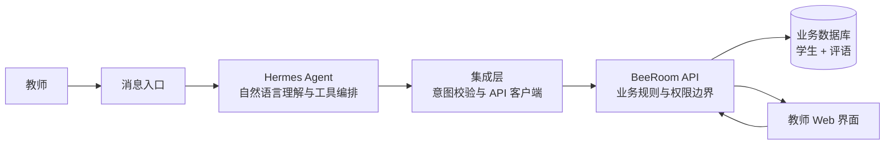

# BeeRoom × Hermes Showcase

这是一个用于展示业务架构的脱敏文档仓库，介绍 BeeRoom 如何与 Hermes Agent 集成，帮助教师通过自然语言记录和管理学生评语。

仓库只保留业务说明，不包含生产代码、真实数据、AI API key、Telegram credential、服务器配置、数据库凭据或本地文件路径。

## 业务目标

教师在课堂或课后可以直接用自然语言表达意图，例如：

> 给学生 A 加一句：今天主动帮助同学整理材料。

系统负责完成以下工作：

1. 理解教师的自然语言。
2. 匹配正确的学生。
3. 将内容整理成结构化评语。
4. 在写入前展示预览并请求确认。
5. 将新评语放入待审核队列。
6. 审核后出现在学生的评语时间线中。

## 总体架构



Hermes 负责理解意图和选择工具，BeeRoom API 负责业务校验和数据读写。Hermes 不直接访问数据库，也不执行任意 SQL。

## 核心数据模型

系统将业务模型保持为两张核心表：

| 表 | 用途 |
|---|---|
| `student` | 学生身份、学号、班级、年级和别名 |
| `comment` | 日期、主题、类别、评语正文、证据、来源和审核状态 |

评语通过 `student_id` 与学生关联；无法唯一匹配的内容可以先进入待处理状态，避免误记到错误学生名下。

## 一条消息的处理流程

```text
教师自然语言
  → Hermes 识别动作、学生、日期和内容
  → 查询学生并检查是否唯一
  → 生成写入预览
  → 教师明确确认
  → 调用 BeeRoom 业务 API
  → 评语进入待审核队列
  → 教师审核后进入学生时间线
```

## 设计原则

- API 是唯一的业务数据读写入口。
- 所有写操作都需要明确确认。
- 同名学生不能凭猜测绑定，必须追问班级或学号。
- 新评语默认处于待审核状态。
- 原始自然语言可以作为来源保留，但不能替代结构化校验。
- 错误信息向教师提供可理解的提示，不暴露内部路径、标识符或凭据。
- 展示环境使用占位符，不连接任何真实服务。

## 文档

- [业务与 Hermes 集成架构](docs/business-architecture.md)

## 免责声明

本仓库是架构展示材料，不是可直接部署的生产系统。任何真实部署都需要单独配置身份认证、访问控制、密钥管理、日志策略和数据保护措施；这些配置不会放在本仓库中。
