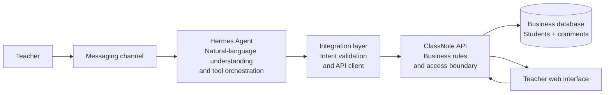

# ClassNote × Hermes Showcase

This repository is a sanitized showcase of the ClassNote business architecture, selected business-code modules, and its integration with Hermes Agent.

It contains no production deployment code, real user data, AI API keys, Telegram credentials, server configuration, database credentials, or local file paths.

## Business goal

Teachers often capture classroom observations as short, informal notes: a student understood a concept, helped a classmate, participated actively, or needs encouragement. ClassNote turns these observations into reviewable student comments without requiring the teacher to stop and complete a complex form.

A teacher can write a message such as:

> Add a note for Student A: they took the initiative to help a classmate organize the materials today.

The system then:

1. Understands the teacher's natural-language intent.
2. Matches the correct student.
3. Converts the observation into a structured comment.
4. Shows a preview and asks for confirmation before writing.
5. Places the new comment in a review queue.
6. Shows the approved comment in the student's timeline.

## Architecture



Hermes understands intent and selects approved tools. The ClassNote API validates business rules and performs data access. Hermes never connects directly to the database and never executes arbitrary SQL.

## Core data model

The business model is intentionally kept to two core tables:

| Table | Purpose |
|---|---|
| `student` | Student identity, student code, class, year level, and aliases |
| `comment` | Date, topic, category, comment text, evidence, source, and review status |

Comments reference students through `student_id`. If a name cannot be matched uniquely, the content can remain unassigned for review rather than being attached to the wrong student.

## Message flow

```text
Teacher's natural-language message
  → Hermes identifies the action, student, date, and content
  → Student lookup and uniqueness check
  → Write preview
  → Explicit teacher confirmation
  → ClassNote business API call
  → Comment enters the review queue
  → Teacher approval
  → Comment appears in the student timeline
```

## Integration principles

- The API is the only business data read/write entry point.
- Every write operation requires explicit confirmation.
- Ambiguous student names require a follow-up question; Hermes must not guess.
- New comments enter a pending-review state by default.
- Original natural-language input can be retained as source context, but does not bypass structured validation.
- User-facing errors are understandable and do not expose internal identifiers, paths, or credentials.
- The showcase uses abstract component names and placeholders only; it does not connect to a real service.

## Documentation

- [Business and Hermes integration architecture](docs/business-architecture.md)

## Business code snapshot

The public code is organized around the business flow:

```text
backend/app/models.py          two-table persistence model
backend/app/schemas/            API contracts
backend/app/repositories/      student and comment operations
backend/app/services/           matching and text ingestion
backend/app/api/                student and comment endpoints
frontend/src/                   teacher-facing workflow pages
```

This is a reviewable business-code snapshot. Deployment files, environment files, database snapshots, provider adapters, messaging credentials, and local development server settings are intentionally excluded.

## Hermes feature integration notes

The following notes record how selected Hermes capabilities could be integrated into ClassNote. Each feature is evaluated at the system boundary first; the public code snapshot remains intentionally provider-neutral and does not contain operational Hermes configuration.

### 1. Tools and toolsets

**Capability.** Hermes groups callable tools into toolsets that can be enabled or disabled per platform. The documented tool categories include web, terminal and file operations, orchestration, memory, automation, and integrations.

**ClassNote integration.** Add a small, dedicated ClassNote toolset containing only business-safe operations such as `find_students`, `preview_comment`, `submit_comment`, and `list_review_queue`. Hermes can use read-only tools for lookup and preview; the write tool should be exposed only after an explicit confirmation turn. The integration layer remains an API client, so Hermes never receives database credentials and never generates executable SQL.

**End-to-end flow.** Telegram message → Hermes intent extraction → student lookup tool → disambiguation if needed → preview tool → teacher confirmation → submit tool → ClassNote API validation → pending comment. The API should enforce the same rules even if a tool is called incorrectly.

**Interfaces and feasibility.** Define stable JSON schemas for tool inputs and outputs, include an idempotency key for writes, and return user-safe error codes. This is highly feasible because it fits the existing API boundary; the main dependency is a Hermes adapter that registers the allowlisted tools.

**Security decision.** Do not enable general terminal, filesystem, or arbitrary database tools for the production ClassNote conversation. Keep business tools narrowly scoped, log tool names and request IDs rather than raw student content, and require confirmation for every mutation.

Source: [Hermes Tools & Toolsets](https://hermes-agent.nousresearch.com/docs/user-guide/features/tools) and [Hermes feature overview](https://hermes-agent.nousresearch.com/docs/user-guide/features/overview).

### 2. Skills system

**Capability.** Hermes skills are on-demand knowledge and workflow documents. They are loaded when relevant instead of being placed into every prompt, and can encode repeatable procedures, domain rules, and tool usage.

**ClassNote integration.** Provide a sanitized `classnote-comment-workflow` skill for the Hermes agent. It should describe how to recognize an observation, map it to the two-table model, resolve aliases, ask for clarification, create a preview, and request confirmation. The skill should contain examples and validation rules, but no student roster, secret, local path, or provider credential.

**End-to-end flow.** A teacher message activates the skill → the skill selects the allowlisted ClassNote tools → the API returns candidate students or a preview → Hermes follows the confirmation protocol → the API stores the pending comment. The skill improves consistency, while the API remains authoritative for validation.

**Interfaces and feasibility.** Version the skill with the public business contract and test it against representative ambiguous-name and duplicate-name cases. Keep the tool names and JSON fields aligned with `backend/app/schemas/`; no database change is required for the first version. This is feasible and is a low-risk way to keep natural-language behavior maintainable.

**Security decision.** Treat skills as instructions, not as a trust boundary. Never place credentials or real student data in a skill. The integration layer must reject tool calls that violate authorization, confirmation, class scope, or field constraints, even when the skill suggests them.

Source: [Hermes Skills System](https://hermes-agent.nousresearch.com/docs/user-guide/features/skills).

### 3. Persistent memory

**Capability.** Hermes keeps bounded, curated memory across sessions, with separate space for agent notes and user preferences. The documentation also warns that memory is scoped to an agent profile and should not be shared casually by multiple agent processes.

**ClassNote integration.** Use memory only for low-risk teacher preferences: a default class, preferred language, preferred comment tone, or whether previews should include evidence. Do not use it as the source of truth for student identity, safeguarding information, grades, or comment history; those belong behind the ClassNote API.

**End-to-end flow.** Teacher sets a preference → Hermes stores a minimal preference entry → later message is interpreted with that preference → the integration layer still sends explicit class and student identifiers to the API → the API applies authorization and business validation. A preference must never silently select among two students with the same name.

**Interfaces and feasibility.** Add a profile-scoped preference adapter with `get_preferences` and `update_preferences`, or start with Hermes-managed memory and keep the ClassNote API stateless. The first option is feasible for a single teacher; a multi-teacher deployment should move shared preferences into an authenticated service with tenant isolation.

**Security decision.** Apply data minimization, retention limits, and an exclusion list for sensitive student data. Provide a reset path and show the teacher when a stored preference affects a preview. Memory failures should degrade to an explicit question, not to a guessed class or student.

Source: [Hermes Persistent Memory](https://hermes-agent.nousresearch.com/docs/user-guide/features/memory).

### 4. Context files

**Capability.** Hermes discovers project context files and uses them to shape behavior, including project instructions, conventions, architecture notes, and personality guidance. The discovery and priority rules make repository-level instructions reusable across sessions.

**ClassNote integration.** Maintain a sanitized project context document that describes the ClassNote domain vocabulary, two-table model, API boundary, review states, confirmation rules, and examples of safe responses. This gives Hermes a stable contract for natural-language orchestration without embedding operational configuration in the public code snapshot.

**End-to-end flow.** Hermes loads the project context at session start → teacher sends an observation → the agent applies the domain rules → selected tools perform lookup and preview → ClassNote validates and persists the result. When the contract changes, update the context document and the API schemas together.

**Interfaces and feasibility.** Add a versioned context contract beside the business documentation and test it with the same sample messages used by the API tests. Keep deployment-specific instructions in a private, untracked override rather than in the showcase repository. This is immediately feasible and does not require a schema change.

**Security decision.** Context files are prompt inputs, not access control. They must not contain credentials, private endpoints, local machine paths, real student records, or instructions that bypass API validation. A repository scan should run before publishing changes.

Source: [Hermes Context Files](https://hermes-agent.nousresearch.com/docs/user-guide/features/context-files).

### 5. Context references

**Capability.** Hermes can expand references such as a file, folder, diff, recent Git history, or URL inline in a message. This lets a user attach precise context without copying an entire document into chat.

**ClassNote integration.** Use references for teacher-controlled, reviewable inputs such as a sanitized class roster export, an observation draft, or a selected report. The integration layer should convert referenced content into a bounded structured payload before calling ClassNote; a reference must never become a direct database or filesystem capability.

**End-to-end flow.** Teacher attaches an allowed context reference → Hermes receives the expanded content → the skill extracts student candidates and observation text → Hermes calls read-only lookup and preview tools → teacher confirms → the API writes the pending comment. If the reference is too large, unsupported, or ambiguous, the agent asks for a narrower input.

**Interfaces and feasibility.** Define an attachment envelope with source type, content hash, size limit, and redaction status. Add an API-side validation step that accepts only the fields needed by the comment workflow. This is feasible for file-based workflows; URL references should remain disabled initially because they create an additional data-exfiltration and freshness boundary.

**Security decision.** Enforce an allowlist of reference types and paths in the Hermes integration layer, strip secrets and unnecessary personal data, and avoid returning raw attachments in logs. Never allow `@diff` or arbitrary URLs to bypass the confirmation and privacy checks.

Source: [Hermes Context References](https://hermes-agent.nousresearch.com/docs/user-guide/features/context-references).

### 6. Checkpoints and rollback

**Capability.** Hermes can snapshot a project before destructive file or terminal operations and restore a previous checkpoint. The feature is a development safety net; it is separate from the application's business data.

**ClassNote integration.** Enable checkpoints for Hermes work that edits the public integration skill, context contract, or showcase code. For runtime comments, use ClassNote's domain workflow instead: a pending review queue, explicit approval, and a correction path. Rolling back a project file must not be treated as rolling back a comment already written to the API.

**End-to-end flow.** Hermes prepares a code or contract change → checkpoint is created → tests and security scan run → the change is committed or restored. Separately, a teacher message follows preview → confirmation → API write → review. The two rollback domains stay clearly separated in the user-facing status message.

**Interfaces and feasibility.** No production schema change is needed. Add an audit or request ID to the API response so the UI can direct a teacher to edit or reject the domain object rather than suggesting a filesystem rollback. This is feasible and useful for maintaining the integration artifacts.

**Security decision.** Checkpoints may retain historical file content, so they need the same access and retention controls as the workspace. Never checkpoint a directory containing runtime secrets or real student exports in the public showcase workflow, and do not expose rollback commands through the teacher-facing business toolset.

Source: [Hermes Checkpoints and `/rollback`](https://hermes-agent.nousresearch.com/docs/user-guide/checkpoints-and-rollback).

### 7. Scheduled tasks (Cron)

**Capability.** Hermes exposes scheduled one-shot and recurring tasks through a cron tool. Jobs can be paused, resumed, edited, triggered, and delivered back to the originating chat or a configured platform target; a job may also run without an LLM when a deterministic script is sufficient.

**ClassNote integration.** Use this for read-only classroom workflows such as a daily pending-review digest, a weekly observation summary, or a reminder to review unapproved comments. A scheduled job may call a reporting endpoint and send a concise result to the teacher, but it must not silently create comments or approve them.

**End-to-end flow.** Teacher asks Hermes to schedule a digest → Hermes stores the schedule → at fire time the job calls a scoped ClassNote reporting tool → the API checks teacher and class access → Hermes formats the result → the configured messaging adapter delivers it. Any write action should return to the normal preview and confirmation flow.

**Interfaces and feasibility.** Add a read-only `review_summary` API contract with a time window, class scope, and result limit. Keep schedule ownership and provider/model policy in the Hermes runtime at first; only add a ClassNote schedule table if product requirements later need a web dashboard or cross-channel management. This is feasible as a low-risk read path.

**Security decision.** Require an explicit owner and class scope for every job, avoid placing student names in job titles, pin the execution policy for unattended jobs, and fail closed when authorization or the configured model is unavailable. Do not put credentials, private destinations, or raw student records into the public repository.

Source: [Hermes Scheduled Tasks](https://hermes-agent.nousresearch.com/docs/user-guide/features/cron).

### 8. Subagent delegation

**Capability.** Hermes can delegate independent work to child agents with isolated context and inherited tool access. The parent receives a final summary, while background completion delivery can be retried when a gateway or session route is temporarily unavailable.

**ClassNote integration.** Delegate bounded, read-only tasks such as summarizing observations for separate classes, checking alias candidates, or generating a draft report. The parent agent remains the orchestrator: it combines results, resolves conflicts, presents one preview, and owns the only confirmation that can reach a write tool.

**End-to-end flow.** Parent receives a request → partitions it by class or report section → children call scoped read-only ClassNote tools → each child returns structured findings with confidence and source IDs → parent merges and deduplicates → teacher confirms the final preview → parent performs one idempotent API write per approved comment.

**Interfaces and feasibility.** Define a child-task envelope containing tenant, teacher, class scope, purpose, deadline, and maximum records; define a structured result with errors instead of free-form success claims. Add bounded concurrency and retry handling. This is feasible for reporting, but should not be the first path for simple single-student comments.

**Security decision.** Children receive the minimum data and tools necessary, never credentials or unrestricted terminal access. Child agents cannot approve comments, alter class membership, or write directly. Treat late, duplicated, or partial completions as untrusted until the parent validates them and the API enforces idempotency.

Source: [Hermes Subagent Delegation](https://hermes-agent.nousresearch.com/docs/user-guide/features/delegation).

### 9. Code execution

**Capability.** Hermes can run generated Python that calls Hermes tools programmatically. Intermediate tool results stay inside the script and only the final printed output returns to the model, which is useful for loops, filtering, and multi-step transformations.

**ClassNote integration.** Use this capability for deterministic, bounded processing around the API: normalize a batch of observations, validate candidate mappings, calculate a report, or transform a review-queue response into a teacher-friendly summary. The script should call typed ClassNote tools or the integration client, never construct SQL or open the database directly.

**End-to-end flow.** Hermes receives a batch request → a sandboxed script calls read-only ClassNote operations → the script validates and reduces the results → it prints a typed summary → Hermes presents a preview or asks a follow-up question. Any mutation still goes through the normal confirmation and API write tool outside the script.

**Interfaces and feasibility.** Define maximum input size, execution time, output schema, and allowed tool names. Start with read-only report generation; add a separate, audited batch-write operation only after idempotency and partial-failure behavior are proven. This is feasible, but it is more complex than direct tool calls and should be reserved for genuinely multi-step work.

**Security decision.** Run with no database socket, no secret environment variables, no unrestricted network, and no arbitrary filesystem access. Redact student content from exceptions and logs. If the sandbox is unavailable, fail closed and return a normal user-facing error rather than falling back to arbitrary shell execution.

Source: [Hermes Code Execution](https://hermes-agent.nousresearch.com/docs/user-guide/features/code-execution).

### 10. Event hooks

**Capability.** Hermes provides gateway, plugin, shell, and outbound webhook hooks at lifecycle points. Hooks can log, transform, inject context, measure activity, or block a tool call; callback failures are isolated, while control hooks can fail closed.

**ClassNote integration.** Add a narrow integration hook set for audit and guardrails: record a request ID and high-level action, reject a write without a confirmation token, attach correlation metadata to API calls, and publish non-sensitive metrics for latency and errors. A post-write event can update observability, but the ClassNote API remains the source of truth for the result.

**End-to-end flow.** Telegram message enters Hermes → a pre-tool hook checks platform identity, allowed tool, class scope, and confirmation state → the integration client calls ClassNote → the API validates and persists → a post-tool hook records success or failure without raw student text → Hermes replies with the API result. Hook failure must never turn an unconfirmed request into a write.

**Interfaces and feasibility.** Standardize a small event envelope with event type, correlation ID, actor scope, tool name, outcome, and retention classification. Keep business authorization in the API and use hooks as a second guardrail and audit signal. This is feasible and valuable once the basic toolset exists; begin with logging and pre-write blocking.

**Security decision.** Do not log credentials, full message bodies, audio, or unrestricted API responses. Sign outbound events if an external audit sink is added, rate-limit retries, and make write operations idempotent. Test both hook failure and duplicate delivery so the teacher never sees a false success.

Source: [Hermes Event Hooks](https://hermes-agent.nousresearch.com/docs/user-guide/features/hooks).

### 11. Document extraction

**Capability and business value.** Hermes can convert common Word, spreadsheet, notebook, and PDF files into paginated Markdown, and can warn when scanned PDF pages have no text layer. This lets teachers use existing roster exports or observation worksheets without retyping them.

**Proposed integration and data flow.** Add an attachment-ingestion adapter before the existing intent layer: approved attachment → type and size validation → Hermes extraction → coverage and redaction check → structured candidate records → student lookup or comment preview → explicit confirmation → ClassNote API.

**Implementation boundary.** No database change is needed initially. Add an attachment envelope with type, size, checksum, extraction status, and source reference. Keep extracted text ephemeral unless retention is explicitly requested.

**Risks and recommendation.** Documents may contain unrelated personal data, hidden formulas, or unreadable scans. Enforce limits, redact unnecessary fields, and never log raw documents. Recommend a read-and-preview pilot using sanitized exports before bulk writes.

Source: [Hermes Document Extraction](https://hermes-agent.nousresearch.com/docs/user-guide/features/document-extraction).

### 12. Tool Search

**Capability and business value.** Hermes can defer MCP and non-core plugin schemas and discover them progressively through search, description, and call bridge tools. This reduces prompt noise when a ClassNote deployment eventually has reporting, storage, calendar, and messaging integrations.

**Proposed integration and data flow.** Keep student lookup, preview, and submit tools in a fixed allowlist; put optional read-only tools behind Tool Search: user intent → catalog search → schema description → local argument validation → approved integration client → ClassNote API or another explicitly permitted service.

**Implementation boundary.** No database change is required. Maintain a tool registry with capability ID, operation type, authorization scope, and confirmation requirement. A discovered tool name must never become permission to access arbitrary data.

**Risks and recommendation.** Retrieval may select the wrong tool, and newly installed plugins can expand the reachable surface. Restrict the catalog per session, keep writes non-discoverable until explicitly enabled, and audit the resolved tool name. Recommend this only when the optional toolset becomes large.

Source: [Hermes Tool Search](https://hermes-agent.nousresearch.com/docs/user-guide/features/tool-search).

### 13. LSP semantic diagnostics

**Capability and business value.** Hermes can run language servers after file edits and report new semantic diagnostics such as type errors, unresolved names, and missing imports. This is useful for keeping the ClassNote backend, frontend, and integration client aligned.

**Proposed integration and data flow.** Use LSP during development, not in the teacher-facing workflow: developer edits integration code → Hermes captures a baseline → the change is applied → new diagnostics are reported → tests and review decide whether the change is publishable.

**Implementation boundary.** No runtime database or API change is required. Keep language-server setup generic and treat API contract tests as the authority for business correctness.

**Risks and recommendation.** Toolchain differences can create noisy or incomplete diagnostics, and a clean semantic check does not prove correct student matching. Recommend LSP as a development quality gate and never as a production dependency.

Source: [Hermes LSP — Semantic Diagnostics](https://hermes-agent.nousresearch.com/docs/user-guide/features/lsp).

### 14. Curator

**Capability and business value.** Hermes Curator tracks use of agent-created skills, moves inactive skills through active, stale, and archived states, and proposes consolidation or drift fixes. This can prevent multiple ClassNote workflow skills from competing for context.

**Proposed integration and data flow.** Protect the core comment workflow skill and use Curator for optional report-writing, roster-import, and experimental skills: skill update → usage tracking → inactivity or drift signal → maintainer reviews proposed change → approved version is published or safely archived.

**Implementation boundary.** No ClassNote database change is needed. Keep skill ownership, version, and review metadata in the private maintenance process rather than in student or comment tables.

**Risks and recommendation.** A rarely used safeguarding rule could be misclassified as stale, and generated patches can change behavior. Exclude mandatory skills, review every patch, and preserve recoverable history. Recommend Curator after the skill library grows beyond manual management.

Source: [Hermes Curator](https://hermes-agent.nousresearch.com/docs/user-guide/features/curator).

### 15. External memory providers

**Capability and business value.** Hermes supports external memory-provider plugins for cross-session knowledge, background prefetching, conversation synchronization, memory extraction, and provider-specific memory tools. This could reduce repeated setup questions about a teacher’s preferred language or comment tone.

**Proposed integration and data flow.** Use an external provider only for teacher-scoped preferences: opt-in → provider returns preference context → Hermes drafts a preview → ClassNote API validates current student data → teacher confirms → only permitted preference metadata is synchronized.

**Implementation boundary.** No core database change is required initially. Define a provider-neutral preference contract, consent and deletion controls, retention policy, and tenant scope. Provider credentials and configuration stay outside the public repository.

**Risks and recommendation.** External storage expands the privacy boundary and may return stale or cross-tenant context. Start with built-in memory, prohibit student records from synchronization, and add a provider only after consent and deletion behavior are tested.

Source: [Hermes Memory Providers](https://hermes-agent.nousresearch.com/docs/user-guide/features/memory-providers).

### 16. Honcho Memory

**Capability and business value.** Honcho is a memory provider that builds a persistent model of user preferences, communication style, goals, and patterns, with session summaries, semantic search, conclusions, and separated peer profiles. It may improve continuity for a teacher but is unnecessary for a simple comment.

**Proposed integration and data flow.** If evaluated, connect it only to a teacher-preference adapter: opt in → retrieve scoped preference context → generate preview → ClassNote performs identity and business validation → teacher confirms → record a minimal preference update if permitted.

**Implementation boundary.** No student or comment schema change is needed. Add consent, provider status, and deletion controls at the integration or account-settings layer, with a hard separation between teacher profile data and classroom records.

**Risks and recommendation.** Inferred personal information can exceed the teacher’s intent, and an external provider adds compliance and availability dependencies. Recommend not adopting Honcho for the first production version; consider only a tightly limited preference pilot.

Source: [Hermes Honcho Memory](https://hermes-agent.nousresearch.com/docs/user-guide/features/honcho).

### 17. Mixture of Agents

**Capability and business value.** Hermes can use a Mixture of Agents preset in which reference models analyze first and an aggregator produces the response and tool calls while preserving the normal Hermes loop. Multiple perspectives may help with ambiguous names or mixed observations.

**Proposed integration and data flow.** Route only high-ambiguity drafting and reporting to MoA: Telegram request → reference analysis → aggregator produces structured intent → read-only lookup and preview → teacher confirmation → ClassNote API write → review queue. Simple messages should use the normal path.

**Implementation boundary.** No database change is required. Add routing based on ambiguity, task type, and latency budget, with a correlation ID for comparing MoA and normal-model outcomes.

**Risks and recommendation.** MoA increases latency, cost, provider complexity, and draft variance. It cannot replace deterministic identity matching or confirmation. Recommend offline evaluation first, then an opt-in fallback for difficult read and preview cases.

Source: [Hermes Mixture of Agents](https://hermes-agent.nousresearch.com/docs/user-guide/features/mixture-of-agents).

### 18. Personality and SOUL.md

**Capability and business value.** Hermes uses a durable personality file as the agent identity, with optional session-level personality presets. A consistent, calm, teacher-friendly voice can make clarification questions and confirmation prompts easier to understand.

**Proposed integration and data flow.** Define a ClassNote communication style that is concise, supportive, transparent about uncertainty, and explicit about confirmation: Hermes loads the approved style → interprets the message → presents a preview or clarification → reports the API result without changing its meaning.

**Implementation boundary.** No database or API change is required. Keep the approved style separate from skills and API authorization, and keep the public example free of credentials, private endpoints, and student data.

**Risks and recommendation.** Personality text can be edited or misinterpreted and must never override privacy, confirmation, or API validation. Recommend a small reviewed style guide with regression examples rather than a broad persona that invents policy.

Source: [Hermes Personality & SOUL.md](https://hermes-agent.nousresearch.com/docs/user-guide/features/personality).

### 19. Plugins

**Capability and business value.** Hermes plugins add custom tools, hooks, and integrations without changing Hermes core. A ClassNote plugin can package the business boundary cleanly and keep Telegram tools separate from generic Hermes capabilities.

**Proposed integration and data flow.** Register typed tools for student lookup, preview, submit, and review queue operations: Hermes loads the plugin → model selects a tool → plugin validates scope and arguments → authenticated API client calls ClassNote → API applies business rules → plugin returns a safe result.

**Implementation boundary.** No database change is needed. Maintain plugin version, supported API contract, capability allowlist, and compatibility tests. Do not include credentials, operational configuration, or real endpoints in the public repository.

**Risks and recommendation.** A plugin executes code inside the Hermes runtime and can become an alternate path around guardrails. Pin versions, review handlers, restrict tools by profile, and fail closed on missing authorization. Recommend this as the preferred production integration boundary once the API contract is stable.

Source: [Hermes Plugins](https://hermes-agent.nousresearch.com/docs/user-guide/features/plugins).

### 20. Batch processing

**Capability and business value.** Hermes batch processing runs many isolated agent sessions over a JSONL prompt dataset and produces structured trajectories, tool-call statistics, and evaluation metrics. ClassNote can use it to test natural-language understanding against synthetic classroom messages.

**Proposed integration and data flow.** Synthetic prompt dataset → isolated Hermes sessions → mocked or read-only ClassNote tools → structured trajectories → evaluator measures intent accuracy, ambiguity handling, and unsafe-write rate → approved skill or prompt changes.

**Implementation boundary.** No production database change is required. Add an offline evaluation harness and versioned synthetic fixtures if needed; never use real student records or credentials in a batch dataset.

**Risks and recommendation.** Parallel runs can create cost, rate-limit pressure, and misleading results if the corpus lacks realistic ambiguity. Cap concurrency, track model and provider versions, and require human review for safety metrics. Recommend batch processing as a quality gate, not a production write mechanism.

Source: [Hermes Batch Processing](https://hermes-agent.nousresearch.com/docs/user-guide/features/batch-processing).

### 21. Voice Mode

**Capability and business value.** Hermes supports voice interaction across CLI and messaging surfaces, including voice input, transcription, and optional spoken replies. For ClassNote, voice input can let a teacher capture a quick observation while moving around the classroom.

**Proposed integration and data flow.** Telegram voice message → Hermes gateway receives audio → local speech-to-text produces text → Hermes extracts intent and student candidate → ClassNote preview → teacher confirms → API stores a pending comment. Keep the audio outside the business database unless retention is explicitly required.

**Implementation boundary.** The existing two-table model is sufficient. Add only a transient voice-message envelope containing source, transcription status, confidence, and correlation ID; the integration layer passes text, not audio, to the business API.

**Risks and recommendation.** Background noise, names, and accents can cause unsafe student matching. Require a preview, show the transcription, ask when confidence is low, and redact audio from logs. Recommend voice input as an optional convenience with the current local faster-whisper path.

Source: [Hermes Voice Mode](https://hermes-agent.nousresearch.com/docs/user-guide/features/voice-mode).

### 22. Browser Automation

**Capability and business value.** Hermes can navigate websites, interact with page elements, fill forms, and extract information through local or cloud browser backends. This could help import a teacher-selected roster or inspect a report from an approved education system.

**Proposed integration and data flow.** Teacher explicitly requests an import → Hermes opens an allowlisted site → extracts a bounded table → integration layer validates and redacts fields → ClassNote previews proposed student changes → teacher confirms → API persists only approved records. Browser automation must not be the normal path for adding comments.

**Implementation boundary.** Keep browser credentials and sessions in Hermes or the private integration layer. Add a structured import contract with source label, checksum, column mapping, and review status; do not let browser code access the database directly.

**Risks and recommendation.** Pages change, sessions may contain sensitive data, and cloud browsing adds a third-party privacy boundary. Prefer an official export or API, use local browser mode only when necessary, and require human review. Recommend this as a controlled import fallback, not a core ClassNote dependency.

Source: [Hermes Browser Automation](https://hermes-agent.nousresearch.com/docs/user-guide/features/browser).

### 23. Vision and image paste

**Capability and business value.** Hermes can accept pasted images and send them to a vision-capable model for analysis. A teacher might use this to inspect a photographed observation sheet, handwritten note, or classroom artifact.

**Proposed integration and data flow.** Teacher attaches an image → Hermes performs vision analysis → integration layer extracts only the intended observation and candidate student → ClassNote returns a preview → teacher confirms → pending comment is stored. The original image should expire unless the teacher explicitly retains it.

**Implementation boundary.** No student or comment schema change is required. Use a temporary attachment object with size, checksum, redaction status, and extraction confidence; send structured text to the API rather than image content.

**Risks and recommendation.** Images may reveal faces, names, handwriting, or unrelated children, and vision can misread text. Require a clear subject, mask unrelated regions, display extracted text for review, and block low-confidence writes. Recommend a limited pilot with synthetic or teacher-created materials.

Source: [Hermes Vision & Image Paste](https://hermes-agent.nousresearch.com/docs/user-guide/features/vision).

### 24. Image Generation

**Capability and business value.** Hermes can generate images from text prompts through supported image-generation backends. For ClassNote, the safe value is creating neutral dashboard illustrations, classroom workflow diagrams, or visual assets for training material.

**Proposed integration and data flow.** Teacher or maintainer requests an illustration → Hermes generates an image → frontend asset review checks accessibility and appropriateness → approved asset is stored with the showcase or private web app. Generated images should not represent real students or infer student performance.

**Implementation boundary.** This is a frontend and content workflow, not a student-data operation. No database change is required. Keep generated assets separate from student comments and do not send private classroom records into image prompts.

**Risks and recommendation.** Prompts can accidentally disclose personal information, generated imagery can be misleading, and provider usage can have cost or retention implications. Use synthetic prompts, review outputs, and keep the feature disabled in the comment-writing toolset. Recommend it only for documentation and neutral UI assets.

Source: [Hermes Image Generation](https://hermes-agent.nousresearch.com/docs/user-guide/features/image-generation).

## Showcase scope

This repository explains the business problem, user flow, Hermes responsibilities, API boundary, two-table model, review workflow, and privacy principles.

It intentionally does not provide production credentials, real service endpoints, deployment scripts, database snapshots, or an unrestricted natural-language-to-SQL executor.

## Disclaimer

This is architecture material for demonstration purposes, not a deployable production system. A real deployment requires separately managed authentication, access control, secret management, logging, backups, data retention, and privacy controls. Those operational details do not belong in this public repository.
