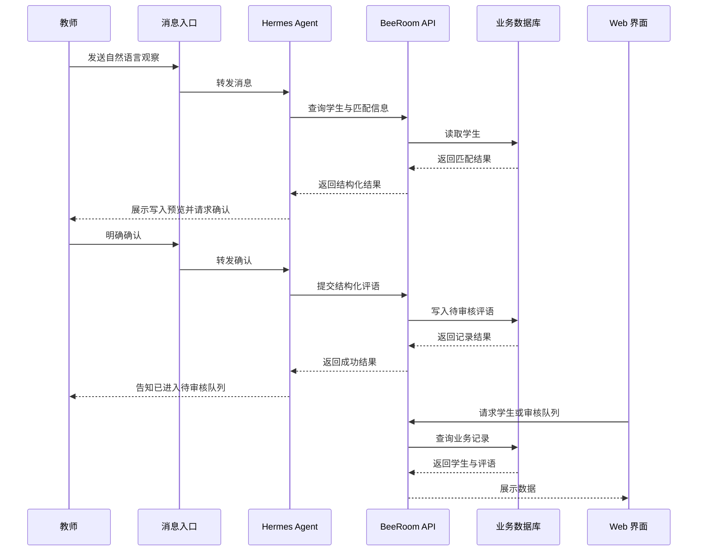

# BeeRoom 与 Hermes 集成：业务架构说明

## 1. 业务背景

教师在课堂中会持续产生大量零散观察：学生是否理解某个概念、是否主动参与、是否帮助同学、是否需要进一步鼓励等。传统表单要求教师中断记录过程，容易造成遗漏，也不适合快速记录。

BeeRoom 的目标是把“教师的一句话”转化为可审核、可追踪的学生评语记录，同时保持教师对最终内容的控制权。

## 2. 业务参与者

| 参与者 | 责任 |
|---|---|
| 教师 | 通过消息或 Web 界面查询、创建和审核评语 |
| 消息入口 | 接收教师的自然语言消息并返回结果 |
| Hermes Agent | 理解自然语言、澄清歧义、编排工具调用 |
| 集成层 | 将 Hermes 的结构化动作转换为受控 API 请求 |
| BeeRoom API | 执行业务规则、校验数据并提供统一读写入口 |
| Web 界面 | 展示学生、评语、待审核队列和时间线 |
| 数据库 | 持久化学生和评语两类核心业务数据 |

## 3. 系统边界

### Hermes 负责什么

- 识别教师想查询、创建、编辑、审核还是拒绝记录。
- 从自然语言中提取学生称呼、班级、日期、主题、类别和观察内容。
- 在信息不足或匹配不唯一时提出澄清问题。
- 按照工具协议调用 BeeRoom API。
- 将 API 结果转换成简洁的教师可读回复。

### BeeRoom API 负责什么

- 校验字段、日期和枚举值。
- 根据姓名、别名、班级或学号完成学生匹配。
- 控制评语的待审核、已审核、已编辑和已拒绝状态。
- 执行学生和评语的查询、创建与更新。
- 统一返回成功、校验失败、未找到和服务错误。

### Hermes 不负责什么

- 不直接读取数据库文件。
- 不生成或执行任意 SQL。
- 不绕过审核流程。
- 不自行猜测同名学生。
- 不保存或展示服务凭据。

## 4. 端到端数据流



## 5. 自然语言到业务动作

示例输入：

> 给学生 A 加一句：今天主动帮助同学整理材料。

Hermes 应先提取出类似以下的业务意图，而不是直接拼接 SQL：

```json
{
  "action": "create_comment",
  "student_reference": "学生 A",
  "comment_text": "今天主动帮助同学整理材料。",
  "comment_date": "由当前业务日期确定",
  "category": "待确认或由业务规则推断",
  "requires_confirmation": true
}
```

接着按以下顺序处理：

1. 查询学生列表。
2. 判断学生引用是否唯一。
3. 如果同名，追问班级或学号。
4. 检查日期和评语正文是否完整。
5. 生成教师可读的预览。
6. 只有收到明确确认后，才调用创建评语动作。
7. 报告 API 的真实结果。

## 6. 工具编排模型

展示版本使用业务动作名称描述工具，不绑定任何真实主机或部署地址。

### 只读动作

| 动作 | 目的 |
|---|---|
| `list_students` | 按班级或关键词查找学生 |
| `get_student` | 查看单个学生资料 |
| `get_student_comments` | 查看学生评语时间线 |
| `list_comments` | 查看评语列表 |
| `get_review_queue` | 查看待审核评语 |

### 写入动作

| 动作 | 目的 | 前置条件 |
|---|---|---|
| `create_student` | 创建学生 | 必填身份信息完整并确认 |
| `create_comment` | 创建单条评语 | 学生唯一匹配并确认 |
| `ingest_text` | 摄取一段课堂记录 | 预览并确认 |
| `approve_comment` | 审核通过 | 指定记录并确认 |
| `edit_comment` | 编辑评语 | 只修改明确指定的字段并确认 |
| `reject_comment` | 拒绝评语 | 指定记录并确认 |

集成层应维护动作到 API 的固定映射。Hermes 只能选择允许的动作和参数，不能改变底层查询语句或访问数据库。

## 7. 两表模型

### `student`

存储学生最小身份信息：

- 内部 ID
- 显示姓名
- 学号
- 班级
- 年级
- 别名

### `comment`

存储一次观察或评语：

- 内部 ID
- 学生关联 ID，可为空
- 评语日期
- 主题
- 类别
- 评语正文
- 事实证据
- 来源文本或来源类型
- 审核状态

不在当前版本中扩展 Unit、Lesson、Audio、Transcript、Report 或其他非核心业务实体。这样可以让自然语言编排层只围绕学生和评语工作，降低误操作面。

## 8. 安全与隐私边界

该展示仓库遵守以下公开原则：

- 不提交任何 AI API key、访问令牌、密码、cookie 或 webhook secret。
- 不提交 Telegram 账号标识、机器人 token 或真实聊天记录。
- 不提交真实域名、IP、端口映射、容器 ID、服务器名称或本地用户路径。
- 不提交数据库文件、导出文件或真实学生名单。
- 不在示例中使用可识别真实个人的信息。
- 所有连接地址、环境变量和部署参数只用抽象名称或占位符表达。
- 生产环境凭据应通过安全的运行时注入机制提供，不能写入代码、文档或日志。

## 9. 失败处理

| 情况 | 教师应看到的结果 |
|---|---|
| 学生不存在 | 提示未找到，并询问是否提供其他称呼或先创建学生 |
| 同名学生 | 要求补充班级或学号，不自动猜测 |
| 缺少评语内容 | 询问缺少的最小必要信息 |
| API 暂不可用 | 说明服务暂时无法连接，不声称已保存 |
| 评语创建成功 | 说明已进入待审核队列 |
| 审核成功 | 说明评语已更新为相应状态 |

错误回复应保持简洁，不向教师暴露堆栈、数据库结构细节、内部标识符或任何 credential。

## 10. 展示仓库与生产系统的区别

本仓库只展示：

- 业务问题和用户流程。
- Hermes 的自然语言理解职责。
- API 与数据库之间的边界。
- 评语审核和隐私保护原则。

本仓库不提供：

- 可直接使用的生产凭据。
- 真实服务地址或网络拓扑。
- 生产部署脚本。
- 真实数据或数据库快照。
- 面向任意数据库的自然语言 SQL 执行器。

实际部署需要由管理员在受控环境中配置认证、网络访问、密钥管理、备份、审计和数据保留策略。
