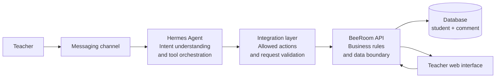
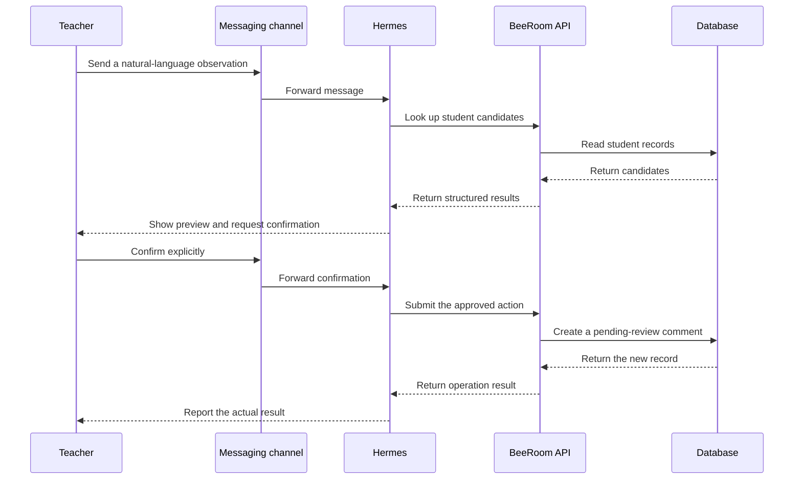

# BeeRoom Business and Hermes Integration Architecture

## 1. Business requirement

Teachers continuously collect small classroom observations: a student understood a concept, participated actively, helped a classmate, or needs encouragement. A traditional form interrupts the teaching workflow and makes these observations easy to lose.

BeeRoom turns a teacher's short natural-language note into a reviewable student comment while keeping the teacher in control of the final record.

Example message:

> Add a note for Student A: they took the initiative to help a classmate organize the materials today.

The system should:

1. Understand the teacher's intent.
2. Identify the referenced student without guessing.
3. Convert the observation into a structured comment.
4. Show a preview before any write.
5. Place new comments in a review queue.
6. Show approved comments in the student's timeline.

## 2. System architecture



The components have deliberately separate responsibilities:

- The messaging channel receives and returns teacher messages.
- Hermes interprets natural language, asks clarifying questions, and selects approved actions.
- The integration layer validates the action shape and calls the corresponding BeeRoom API operation.
- The BeeRoom API owns business validation, matching, review state, and persistence.
- The web interface reads and updates business data through the API.
- The database stores only the two core business entities in this version.

Hermes does not connect to the database and does not execute arbitrary SQL.

## 3. Hermes integration flow



### Intent processing

Hermes should translate a message into a constrained business action, for example:

```json
{
  "action": "create_comment",
  "student_reference": "Student A",
  "comment_text": "Took the initiative to help a classmate organize the materials.",
  "requires_confirmation": true
}
```

The integration layer maps this action to an approved API request. It should not accept arbitrary method names, SQL fragments, URLs, or database commands from the model.

## 4. Student matching

Student references can be a display name or an approved alias. Matching follows these rules:

1. Search the roster using the supplied reference.
2. Apply the class filter when the teacher provides one.
3. Continue only when exactly one student matches.
4. Ask for a class or student code when multiple students match.
5. Keep the comment unassigned when no student can be identified.

This prevents a natural-language shortcut from silently attaching a comment to the wrong student.

## 5. Write confirmation and review

Every write action follows the same sequence:

```text
Parse → validate → preview → explicit confirmation → API write → report result
```

The confirmation must apply to the exact action parameters. If the student, text, date, or other material field changes, Hermes must show a new preview and ask again.

New comments enter `pending_review` by default. Approval, editing, and rejection are separate actions and also require explicit confirmation.

## 6. Two-table business model

### `student`

Stores the minimum identity and roster information:

- internal identifier
- display name
- student code
- class name
- year level
- aliases
- active status

### `comment`

Stores a classroom observation or teacher comment:

- internal identifier
- optional student reference
- comment date
- topic
- category
- comment text
- evidence
- source span
- confidence
- review status
- created and updated timestamps

The current model intentionally does not introduce separate lesson, unit, audio, transcript, report, or audit tables. Those concerns are outside this small showcase model.

## 7. Code map

The public code snapshot is organized by responsibility:

| Path | Responsibility |
|---|---|
| `backend/app/models.py` | SQLAlchemy models for the two entities |
| `backend/app/schemas/` | API input and output schemas |
| `backend/app/repositories/` | Student and comment persistence operations |
| `backend/app/services/` | Transcript normalization, student matching, and text ingestion |
| `backend/app/api/` | Student and comment HTTP API handlers |
| `frontend/src/api.ts` | Small API client used by the web interface |
| `frontend/src/pages/` | Roster, ingestion, review, comments, and timeline views |
| `frontend/src/App.tsx` | Navigation and page composition |

Deployment files, environment files, database snapshots, browser-server settings, provider adapters, messaging credentials, and local development scripts are intentionally not included.

## 8. Error handling

| Situation | Expected behavior |
|---|---|
| No student match | Ask for another reference or keep the comment unassigned |
| Multiple matches | Ask for class or student code; never guess |
| Missing comment content | Ask for the smallest missing field |
| API unavailable | Explain that the service cannot be reached; do not claim success |
| Validation failure | Explain which input needs correction |
| Successful creation | Report that the comment entered the review queue |

Responses should not expose stack traces, internal identifiers, filesystem paths, credentials, or infrastructure details.

## 9. Public-repository safety boundary

This repository is a showcase, not a deployment package. It intentionally excludes:

- AI API keys and access tokens.
- Telegram bot tokens, user IDs, webhook secrets, and chat exports.
- Hermes private configuration and local profiles.
- Feishu or other channel credentials.
- Real domains, IP addresses, container identifiers, server names, and local paths.
- Database files, production exports, and identifiable student rosters.
- Unrestricted natural-language-to-SQL execution.

Real deployments must provide authentication, authorization, secret injection, network controls, audit logging, backup, retention, and privacy controls outside this repository.
